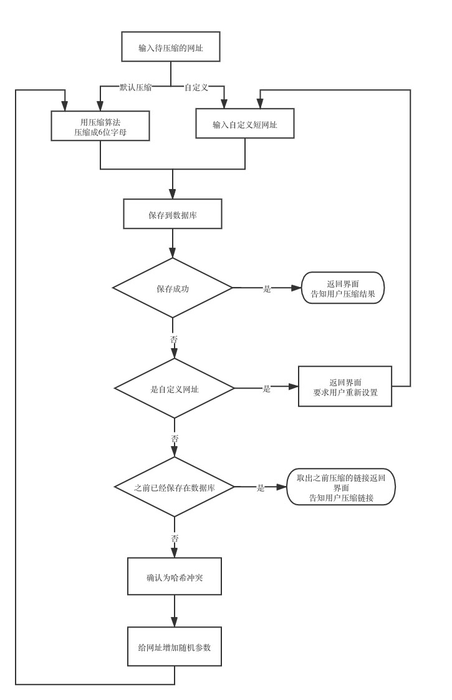

# 短网址小应用

[](https://github.com/RichardLitt/standard-readme)


如果我们在微博里发布一条带网址的信息，微博会把里面的网址转化成一个更短的网址。我们只要访问这个短网址，就相当于访问原始的网址。经典的短网址有 [suo.im](http://suo.im/)、[bitly](https://bitly.com/)、新浪微博的t.cn 。从功能上讲，短网址服务其实非常简单，就是把一个长的网址转化成一个短的网址。除了这个功能之外，短网址服务还有另外一个必不可少的功能。那就是，当用户点击短网址的时候，短网址服务会将浏览器重定向为原始网址。

本项目提供了具体实现代码、如何安装的说明和详细的实现短网址的思路。


## 目录

- [背景](#背景)
- [安装](#安装)
- [用法](#用法)
- [设计思路](#设计思路)
- [核心代码](#核心代码)
- [维护者](#维护者)
- [如何贡献](#如何贡献)
- [许可证](#许可证)


## 背景

经常使用短网址，大致知道其背后原理，在学习王争老师的算法与数据结构之美的过程中，看到有一篇提到如何实现一个短网址，于是想根据其思路**从0开始**捣鼓一个短网址网页应用。


## 和其他的短网址服务有啥不一样？  

首先， 个性化的注记。 其他的短网址服务会把网址压缩成一个不可读的16进制字符串。我的系统可以补充更好记忆的字符串。 

比如,下面的公网体验版， 你注册并且登录之后，把 https://www.bilibili.com/ 记为 bb， 在浏览器里输入 https://jumper.pub/bb 就可以直接跳转到 https://www.bilibili.com/。 <br/> 

还有公网模式，如果你选择压缩的网址是公开的，会在前缀前加上 p/, 比如 https://jumper.pub/p/bb 可以直接访问 https://www.bilibili.com/。

其次，别人有的咱也有。本网站也支持把网址压缩成一个不可读的16进制字符串。<br/>  


## 安装

```shell
git clone https://github.com/notfresh/shorturl_service shorturl_service
```

## 用法

> 本地运行依赖
> docker, docker-compose
>
> 本次开发测试需要依赖：
>
> Python3.6+、Flask、Redis、Nginx、Gunicorn、Sqlite3


1. 用终端 docker-compose 启动

    ```
    # 启动应用
    
    docker-compose up 
    
    # 启动另外一个终端标签,如果有需要升级初始化数据库
    # docker-compose run app python manage.py db upgrade  
    ```

2. 在浏览器访问 `http://locahost/` 即可体验


## 在线版本体验

为了做成一个真正的网页应用，我把它做成了一个在线服务。  

网址是 [https://jumper.pub](https://jumper.pub), 因为是公网环境，而每个人的短网址记忆的需求是不一样的，所以我做了个性化的定制。就是加入了登录功能。  

这里有一个取舍，就是有没有不用登录就可以使用的短网址呢？目前没有做， 有以下几个原因：
1. 别人抢注网址助记符，导致自己没有办法网页跳转。
2. 恶意跳转网址，造成不安全因素。  

鉴于以下原因，所以在公网发布的版本需要登录，才能跳转到自己的短网址映射。  


## 设计思路

如何制作一个短网址的网页应用呢？

答案是通过哈希算法。哈希算法可以将一个不管多长的字符串，转化成一个长度固定的哈希值。我们可以利用哈希算法，来生成短网址。

著名的哈希算法比如 MD5、SHA 等。但是，对于短网址，我们并不需要关注哈希算法的安全性和反解密，只需要关心哈希算法的计算速度和冲突概率。能够满足这样要求的哈希算法有很多，其中比较著名并且应用广泛的一个哈希算法，那就是[MurmurHash 算法]([https://zh.wikipedia.org/wiki/Murmur%E5%93%88%E5%B8%8C](https://zh.wikipedia.org/wiki/Murmur哈希))。

压缩的算法需要三个核心考虑因素：

1. 选择什么算法？我们选择 Murmurhash 32位 哈希算法。
2. 在1的基础上，如何解决哈希冲突问题？**给网址增加随机字符串参数**。
3. 如何优化哈希算法生成短网址的性能？我使用**Redis缓存**，**试探保存法**、可选但是没有实现的比如**布隆过滤器**快速检测冲突。

以下是思路流程图，基本上也是我代码实现的思路：



## 核心代码


压缩网址的算法:  

```python
def rehash_baseh62(the_url_str):
    ls = [str(item) for item in range(10)]

    for item in range(65, 91):
        ls.append(chr(item))

    for item in range(97, 123):
        ls.append(chr(item))

    res = []
    import mmh3
    num = mmh3.hash(the_url_str, signed=False)
    while num:
        res.insert(0, ls[num%62])
        num = num // 62

    return ''.join(res)
```


**把一个网址压缩成短网址的核心流程:** 

```python
def index():
    default_shorten_url = 'Default random'
    form = TheForm(customize_url=default_shorten_url)
    if form.validate_on_submit():

        the_url = form.the_url.data
        customize_url = form.customize_url.data
        full_shorten_url = ''
        while True:
            if customize_url == default_shorten_url:
                shorten_url = rehash_baseh62(the_url)  #压缩算法或者自定义短网址，本系统的核心
            # 查询这个网址有没有被压缩
            # saved_shorten_url = ShortURL.query.filter_by(origin_url)
            else:
                shorten_url = customize_url
            url = ShortURL(origin_url=the_url, shorten_url=shorten_url)
            # 保存
            try:
                # 试探着保存,如果保存成功, 那么跳出循环
                # shorten_url 有可能是唯一的，会引起唯一性索引异常
                db.session.add(url)
                db.session.commit()
                break
            except sa.exc.IntegrityError as e:
                db.session.rollback()
                saved_origin_url = db.session.query(ShortURL.origin_url).filter_by(shorten_url=shorten_url).first()
                # print(shorten_url + " exists, roll back")
                # 自定义短网址命名重复
                if customize_url != default_shorten_url:
                    flash('the assgined name has been taken before')
                    return render_template('index.html', form=form,
                                           shorten_url=make_full_url(app, shorten_url),
                                           taken=True,
                                           took_url=saved_origin_url[0])
                # 没有采用自定义网址, 默认采用压缩的方式, 但是之前已经存储过 或者 压缩的时候哈希冲突
                if customize_url == default_shorten_url:
                    # 之前已经存储过, 不做处理
                    if saved_origin_url[0] == the_url:
                        print("the url has been hash shortened")
                        break
                    # 压缩的时候哈希冲突，概率极小, 做进一步处理
                    else:
                        # 网址里面有附加参数
                        if '?' in the_url:
                            the_url += ('&randomk=' + str(random.random()))
                        else:
                            if the_url[-1] != '/':  # 没有以/结尾
                                the_url += '/'
                            the_url += ('?randomk=' + str(random.random()))
            except Exception as e:
                return render_template('500.html'), 500
        return render_template('index.html', form=form, shorten_url=make_full_url(app, shorten_url))
    return render_template('index.html', form=form)
```


## 维护者

[@notfresh](https://github.com/notfresh)

## 如何贡献

PRs accepted.

Small note: If editing the README, please conform to the [standard-readme](https://github.com/RichardLitt/standard-readme) specification.

## 许可证

MIT © 2020 notfresh


